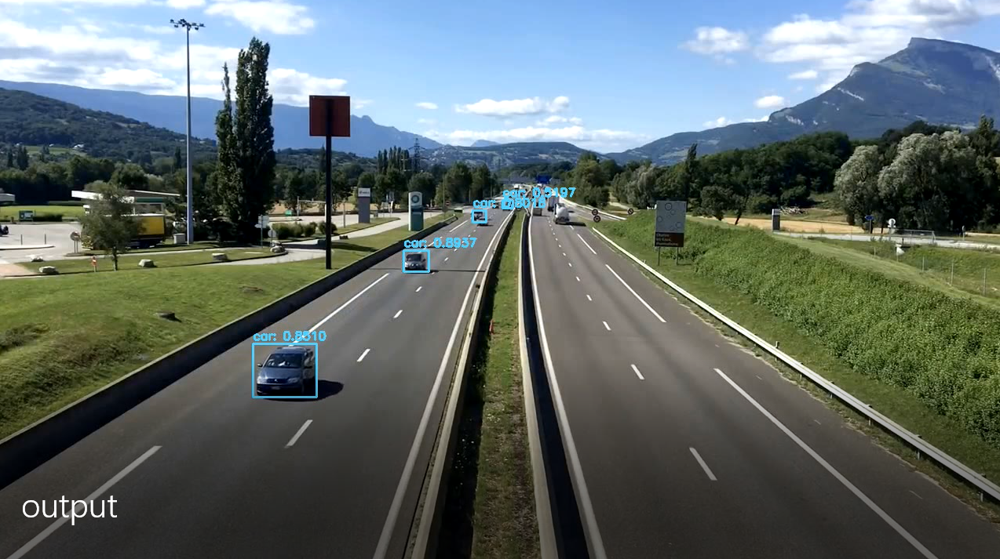

# YOLOv3_Object_Detection_OpenCV
---
### This project describes an implementation of YouOnlyLookOnce algorithm by pjreddie carried out in opencv with which you can detect objects in images, videos and from a live camera feed.
---
  

***Some Details about the YOLO algorithm***
- You only look once (YOLO) is a state-of-the-art, real-time object detection system.
- The algorithm describes a method in which a single forward pass neural network (FNN)
is applied to the whole image and the output of the NN is a prediction of the bounding boxes and their class probabilities.
- The YOLOv3 algorithm has 53 convolutional layers (that is why it is also called (Darknet-53). The strategy for the layout of the filters can be seen below:  
  

--- 
***DETECTION ALGO***
- The algorithm divides the image in a even S x S grid and for each grid, if applicable it predicts bounding boxes as well as a class probabilities.
- Each grid cell is responsible for predicting **B** bounding boxes and **C** class probabilities  of the objects of which the center of the bounding box falls within the region of interest (ROI). Each bounding box has **(5 + C)** attributes, 5 for the probability of an object being present, followed by 4 for the box characteristics (bx, by, bw, bh). C for confidence score for each of the classes (equal to the number of classes). This will be used to perform Non-Maximum Suppression (NMS).
- This means that after completing/running a single forward pass, the network would produce a output tensor of the shape [S, S, B * (5+C)]
- YOLOv3 was trained on the COCO dataset with C=80 and B=3. So, for the first prediction scale, after a single forward pass of CNN, the YOLOv3 outputs a tensor with the shape of [(13, 13, 3 * (5 + 80)].

---

***ANCHOR BOX ALGO***
- A concept of anchor box is used to prevent the overlapping of bounding boxed, that is when the centers of two bounding boxes overlap in the same cell. To prevent this the YOLOv3 uses a set of predefined bounding boxes of a certain dimensions that are used to detect different objects of different ratios with the same center.  
- Since there are 3 prediction scales, there are 9 anchor boxes defined the details of which can be found in the link provided earlier.
---
#### More details on YOLO: Real-Time Object Detection can be found as <https://pjreddie.com/media/files/papers/YOLOv3.pdf>
---
  \
***IMPLEMENTATION USING OPENCV***  
- provides simple image preprocessing using BlobfromImage
- provides direct model development using the svg and weights file
- provides interface to open and display images 

---
## Steps for execution

- Clone the project and run the script in the weights folder to download the weights file
- Make sure you have the neccessary modules installed in your python environment

**For Object Detection in Images**
- Save image in images directory
- run the following code in directory
```
python yolo.py --image filename.jpy
```
- Result:


---
**For Object Detection in Videos**
- Save video in videos directory
- run the following code in directory
```
# with default output (output.avi in main directory)
python yolo.py --video filename.mp4
# with output directory
python yolo.py --video filename.mp4 --output path/to/output
```
- Result:\
Click on the image to open the video on youtube
[](https://www.youtube.com/watch?v=xZPR2gZ7tPA&feature=youtu.be)
---
**For Object Detection in Live feed**
- run the following code in directory
```
python yolo.py
```
- Result:


---


***A Project by Ajaykumar Mudaliar***
